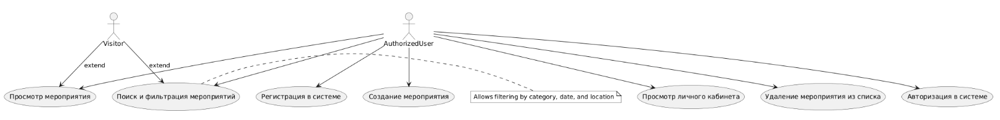

# Use-case diagram 

# Глоссарий

| Термин | Определение |
|:--|:--|
| Авторизованный пользователь | Пользователь, который зарегистрировался в своей учетной записи |
| Личный кабинет | Личный кабинет пользователя со списком мероприятий и списком регистраций |
| Registration | Список мероприятий, на которые пользователь зарегистрировался |
| Event | Сущность, которая может быть добавлена в список мероприятий, которые хочешь посетить |
| Подробности | Подробное описание конкретного мероприятия, включая фотографии, категории и локации |
| Event Filtering | Процесс ввода параметров фильтра и отображения списка в соответствии с этими параметрами |

# EventFlow

# Содержание

Actors
Use Cases
2.1 Авторизация в системе
2.2 Регистрация в системе
2.3 Поиск и фильтрация мероприятий
2.4 Просмотр мероприятия
2.5 Создание мероприятия
2.6 Просмотр личного кабинета

# 1 Актёры

| Актёр | Описание |
|:--|:--|
| Авторизованный пользователь | Пользователь, который зарегистрирован в приложении и может взаимодействовать с комнатами |
| Посетитель | Незарегистрированный пользователь, который может просматривать и искать мероприятия |

# 2 Случаи использования

## 2.1 Войти в учетную запись

**Описание.** Вариант использования "Войти в учетную запись" позволяет пользователю войти в систему для управления своим профилем и списком мероприятий.  
**Предварительные условия.** Пользователь выбрал опцию "Sign in".  
**Main Flow.**
1. Приложение отображает окно входа в учетную запись;
2. пользователь вводит свои учетные данные (почта и пароль);
3. Приложение проверяет введенные учетные данные;
4. приложение присваивает пользователю статус "User";
5. Приложение отображает главное окно со списком мероприятий;
6. Пример использования завершен.

**Альтернативный поток A1.**
1. Приложение показывает сообщение о неправильных учетных данных;
2. Случай использования прекращается преждевременно.

**Postconditions.** Пользователь может зарегистрироваться на мероприятие и добавить свои собственные.

## 2.2 Регистрация

**Описание.** Вариант использования "Регистрация" позволяет пользователю создавать новую учетную запись.  
**Предварительные условия.** Пользователь выбрал "Зарегистрироваться".  
**Main Flow.**
1.  Содержит форму регистрации;
2. Пользователь вводит необходимые данные для регистрации;
3. Приложение проверяет уникальность данных;
4. Приложение присваивает пользователю статус "User";
5. Пример использования завершен.

**Альтернативный поток A2.**
1. Приложение уведомляет пользователя существующей учетной записи;  
2. Возвращается к основному потоку с возможностью ввода различных учетных данных.

## 2.3 Поиск и фильтр

**Описание.** Позволяет пользователю искать мероприятия.  
**Предварительные условия.** Пользователь находится в приложении.  
**Main Flow.**
1. Пользователь вводит запрос поиска;
2. Приложение отображает список мероприятий;
З. Пример использования завершен.

**Альтернативный поток A3.**
1. Пользователь настраивает параметры фильтрации;
2. Приложение отображает отфильтрованный список мероприятий;
З. Пример использования завершен.

## 2.4 Просмотреть детали

**Описание.** Позволяет пользователю просматривать описания мероприятий, регистрироваться на мероприятия и добавлять его в список регистраций.  
**Предварительные условия.** Пользователь выполняет поиск.  
**Main Flow.**
1. Приложение отображает список мероприятий;
2. Пользователь выбирает мероприятие;
З. Приложение отображает подробную информацию;
1. Пример использования завершен.

**Альтернативный поток A4.**
1. Пользователь регистрируется на мероприятие;
2. Пример использования завершен.

**Альтернативный поток A5.**
1. Пользователь добавляет мероприятие;
2. Пример использования завершен.